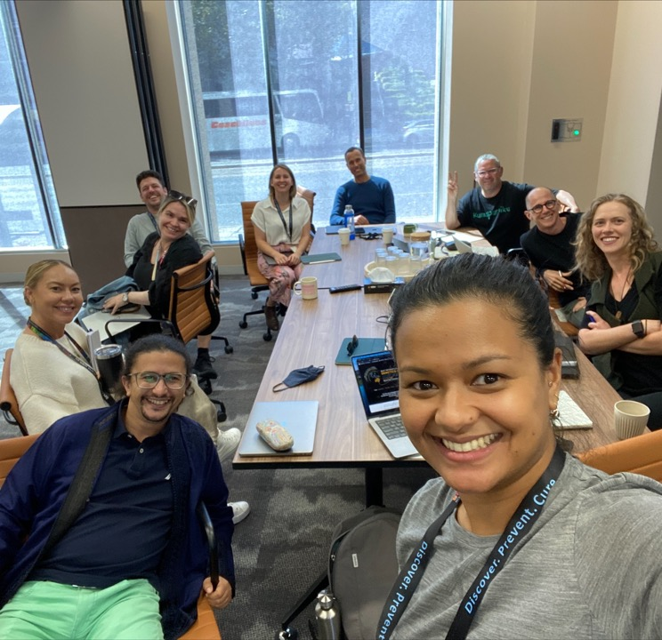

# **Developing a Precision Medicine framework for Indigenous Australians**

## Jimmy Breen 

Black Ochre Data Labs
Telethon Kids Institute & 
Australian National University 

---

# Black Ochre Data Labs

- Public Health & Bioinformatics group
- Based in Adelaide & Perth
- Focused on: 
    - Developing Precision Health approaches for Aboriginal and Torres Strait Islanders
    - Complex diseases that impact Indigenous Australians, including Type 2 Diabetes, Cardiovascular Disease, Chronic/Diabetic Kidney Disease

---

---

# Precision Medicine for all

- Gap between healthcare for Aboriginal and non-aboriginal Australians
- Some treatments are ineffective for diverse communities
---

# The human reference genome does not reflect human diversity

_"Our analysis revealed ~296Mb in ~125k distinct contigs present in the populations of African descent, 
demonstrating that the African pan-genome contains **~10% more DNA than the current human reference genome.**"_

Sherman et al. (2019). "Assembly of a pan-genome from deep sequencing  of 910 humans of African descent" _Nature Genetics_

---

# Implications for Epigenomics

---

# What we know and don't know about the Aboriginal Australian genome

---

# Planned work with our group

---

# Acknowledgements

---

# Acknowledgements

---

# We're recruiting

---

