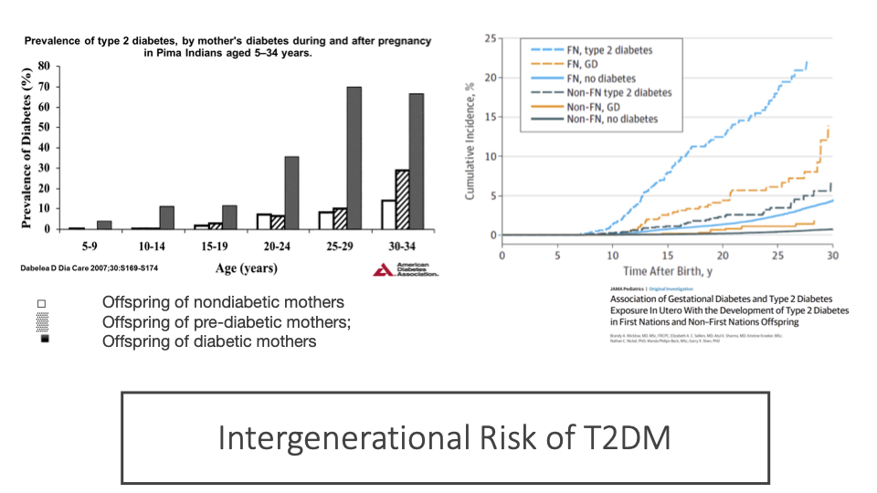

# **Developing a Precision Medicine framework for Indigenous Australians**

## Jimmy Breen 

Black Ochre Data Labs
Telethon Kids Institute & 
Australian National University 

---

# Black Ochre Data Labs

- Public Health & Bioinformatics group
- Based in Adelaide & Perth
- Focused on: 
    - Developing Precision Health approaches for Aboriginal and Torres Strait Islanders
    - Complex diseases that impact Indigenous Australians, including Type 2 Diabetes, Cardiovascular Disease, Chronic/Diabetic Kidney Disease

---

---

# The healthcare gap in Australia

- The growing inequality of healthcare for Aboriginal Australians
    - Infant mortality is **twice the rate of non-Indigenous Australians**.
    - Life expectancy at birth was 71.6 years for Indigenous males **(8.6 years less than non-Indigenous males)** and 75.6 years for Indigenous females **(7.8 years less than non-Indigenous females)**.

---

---

# Future developments in healthcare

- Precision Medicine holds promise to improve treatments for Indigenous Australians
    - Polygenic risk scores, personalised treatments, precise diagnostics etc
- Some treatments are ineffective for diverse communities
    - Misinterpretation of variants, treatment efficiveness
    - e.g. Chemotherapy drug `5-fluorouracil` on African Americans

- **Why?**

<!-- footer: McCollum et al. (2002). _Journal of the National Cancer Institute_ -->

---

<!-- footer: "Davy et al. (2016). _International Journal for Equity in Health_" -->

---

# <!--fit--> The human reference genome does not reflect human diversity
### _i.e. we're missing a lot_

_"Our analysis revealed ~296Mb in ~125k distinct contigs present in the populations of African descent, 
demonstrating that the African pan-genome contains **~10% more DNA than the current human reference genome.**"_

<!-- footer: Sherman et al. (2019). _Nature Genetics_ -->

---

# What we know that we don't know about the Aboriginal Australian genome

_Approximately 25% of all DNA variants in the genome of an Aboriginal person, disregarding variants inherited from non- Aboriginal ancestors, are unknown in people from outside of Australia._
...
_Of these Aboriginal-specific variants, 40% are likely to be found in a single region or community._ 
...
_Overall, ... genomic differences among Aboriginal communities across Australia are as great as those between populations across Europe and Asia combined. Thus, for example, **using information about people from the Northern Territory as a basis for treating people in South Western Australia would be equivalent to treating people with British ancestry on the basis of information about people from Cambodia**._

<!-- footer: Easteal et al. (2020). _The American Journal of Human Genetics_ -->
---

# Implications on Precision Medicine

<!-- footer: "Mahajan et al. (2022). _Nature Genetics_" -->

---

# Diversity in Epigenomics

<!-- footer: Breeze et al. (2022). _Nature Genetics_ -->

---

# What are Black Ochre Data Labs doing about it?

1. Developing a national framework for Indigenous Genomics
    - Collaborating with partners across Australia
    - Led by Alex Brown and Louise Lyons
2. Establishing reference genome resources to quanitfy genomic diversity of Indigenous Australians
    - Collaborating with the National Centre for Indigenous Genomics, ANU
    - Led by Bastien Llamas
3. Investigating the multi-omics structure of Indigenous South Australians within the PROPHECY cohort and develop Epigenetic biomarkers for disease prevention 

---

# What's at stake?

<!-- footer: "" -->

---

# What's at stake?

---

# Acknowledgements

### Black Ochre Data Labs
- Alex Brown
- Bastien Llamas
- Sam Buckberry
- Holly Martin
- Kaashifah Bruce
- Louise Lyons
- Rebecca Simpson
- Sam Godwin
- Yassine Souilmi

### SAHMRI
- Natasha Howard
- Anelle Du Preez

### NCIG
- Azure Hermes
- Hardip Patel

---

# We're recruiting

- We are committed to developing a diverse team of Bioinformaticians
    - Indigenous Australians
    - Female Bioinformaticians
    - 

---

